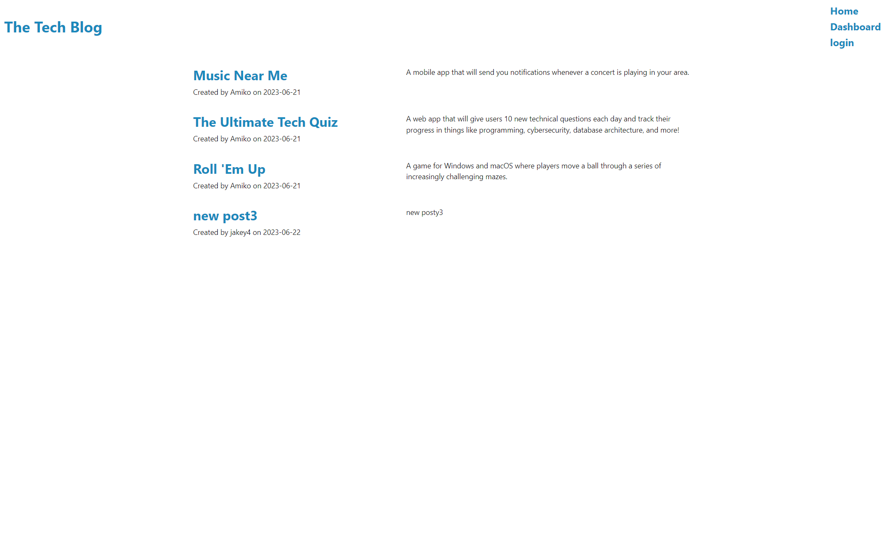
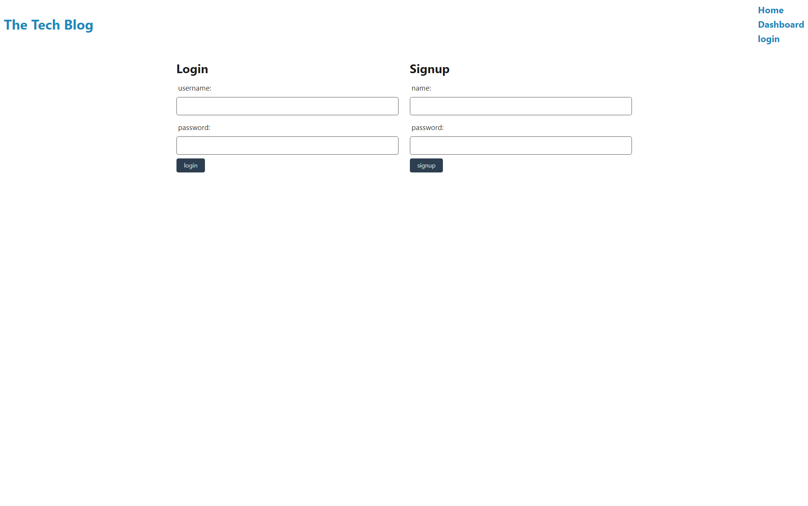
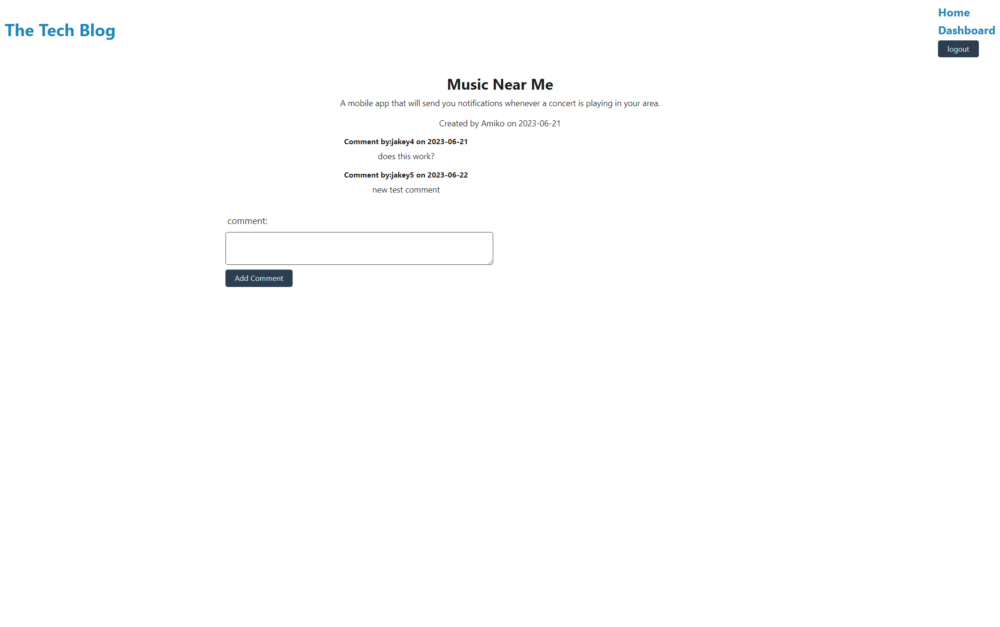
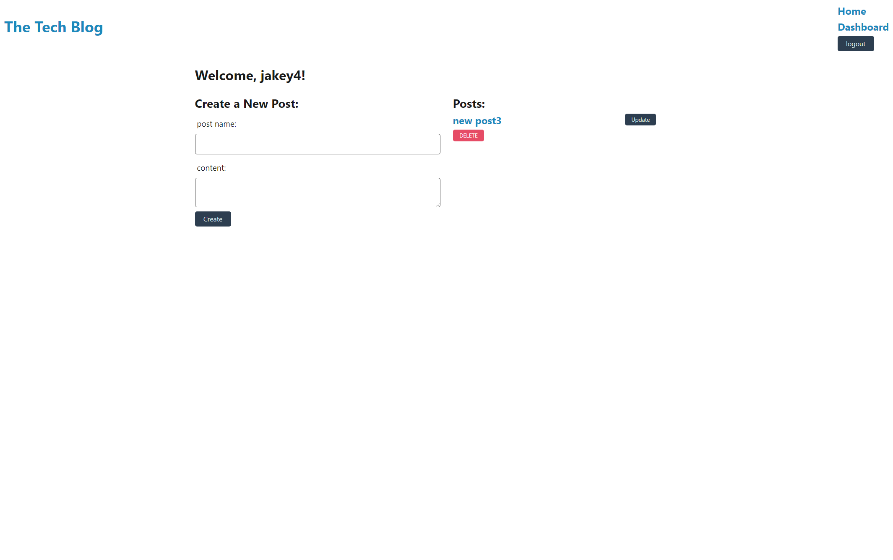
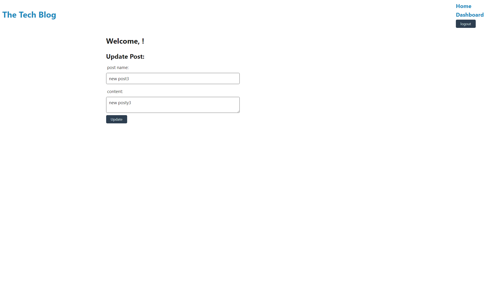

# MVC-Tech-Blog

## Description

Provide a short description explaining the what, why, and how of your project. Use the following questions as a guide:

This application is a blog site where users can publish their posts and comment on other users posts. This can be used as a resource for users to post, discuss, and gain knowledge about various tech/coding topics. This is done by providing users with the ability to create their own accounts to use to create posts and comments with.  

## Installation

N/A

## Usage

When a user visits the tech-blog application they are presented with a homepage that displays any posts made by other users. Users can click on specific posts to navigate to that posts page and leave a comment if already signed in. If user is not signed in they can use the navigation links or the button in the comment area to sign up/login. Once the user has navigated to the sign-up/login page they can enter a name and password in the input boxes to create/login to an account. When user has signed in they can porceed to a post and leave a comment. Logged in users can also visit their dashboard by using the navigation bar which will present them with a form to create their post and display any posts they have already created. When on a users dashboard page a form will be present which can be filled out with a title of post and content of said post. Once a user has filled out the form fields and clicks the create button their post will display in their dashboard along with a delete and update button. Users can also view their posts on the homepage by using the home button in the navigation bar or clicking the title of the web page. While on the dashboard users can click the delete button beside their most recent post to delete said post. Users can also click the update button which will redirect them to a update post page. In the update page users can change the title and content of their post. After making desired changes to their post users can click the update button and will be redirected to their dashboard with their updated post title and content. Once users are finished interacting with the blog-site they can click the logout button to sign out of their account. 

Github URL:https://github.com/Nick-JDA/MVC-Tech-Blog

Deployed site URL: https://tech-bl0g-s1te-90f6a61c7814.herokuapp.com/

Homepage:

Login Page:

Post view page:

User dashboard:

Update post page:

